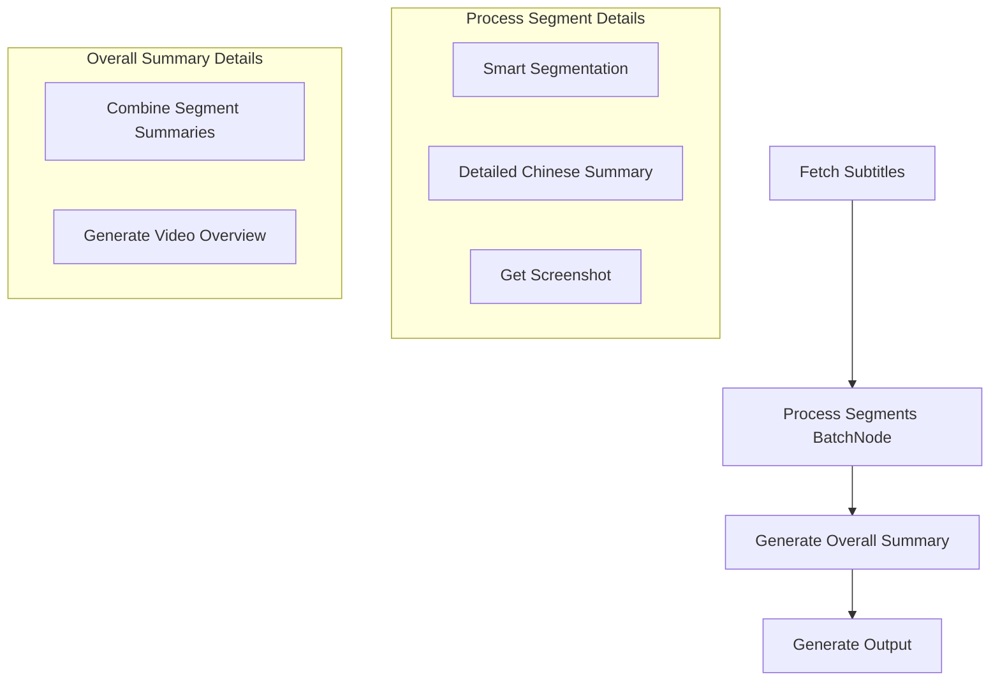

# Design Doc: YouTube Summarizer

> Please DON'T remove notes for AI

## Requirements

> Notes for AI: Keep it simple and clear.
> If the requirements are abstract, write concrete user stories

**用户故事：**
- 作为一个用户，我想要输入一个YouTube视频链接，获得结构化的中文总结
- 作为一个用户，我想要看到每个总结段落对应的时间戳，以便快速跳转到原视频
- 作为一个用户，我想要获得关键时刻的截图，帮助我快速理解视频内容
- 作为一个用户，我想要所有内容（总结、截图）保存在一个文件夹中，便于管理和分享
- 作为一个用户，我想要先看到详细的分段总结，再看到整体的视频总结

**具体需求：**
1. 输入：YouTube视频URL
2. 输出：包含以下内容的文件夹
   - 中文总结的markdown文件（包含时间戳链接）
   - 关键时刻的截图文件
   - 结构化的文件组织
   - 分段详细总结 + 整体视频总结

## Flow Design

> Notes for AI:
>
> 1. Consider the design patterns of agent, map-reduce, rag, and workflow. Apply them if they fit.
> 2. Present a concise, high-level description of the workflow.

### Applicable Design Pattern:

1. **Map-Reduce**: 将字幕分段处理，每段独立进行中文总结和截图获取，最后合并并生成整体总结
2. **Workflow**: 处理步骤：获取字幕 → 分段总结 → 整体总结 → 生成输出

### Flow high-level Design:

1. **Fetch Subtitles Node**: 获取YouTube视频字幕和基本信息（标题、时长等）
2. **Process Segments Batch Node**: 根据字幕内容智能分段，对每段进行详细中文总结并获取截图
3. **Generate Overall Summary Node**: 基于所有分段总结，生成整体的视频总结
4. **Generate Output Node**: 生成结构化的markdown文件和组织文件夹



## Utility Functions

> Notes for AI:
>
> 1. Understand the utility function definition thoroughly by reviewing the doc.
> 2. Include only the necessary utility functions, based on nodes in the flow.

1. **Call LLM** (`src/utils/callLlm.ts`)
   - _Input_: prompt (str)
   - _Output_: response (str)
   - 用于中文总结和整体总结任务

2. **YouTube Subtitles** (`src/utils/getSubtitles.ts`)
   - _Input_: YouTube URL (str)
   - _Output_: { title: str, subtitles: Array<{start: number, end: number, text: str}> }
   - 使用yt-dlp或youtube-transcript-api获取字幕

3. **YouTube Screenshot** (`src/utils/getScreenshot.ts`)
   - _Input_: { videoId: str, timestamp: number }
   - _Output_: imageUrl (str)
   - 获取YouTube视频指定时间的缩略图URL

4. **File System Operations** (`src/utils/fileSystem.ts`)
   - _Input_: various file operations
   - _Output_: success/error status
   - 创建文件夹、下载图片、生成markdown等

5. **Smart Segmentation** (`src/utils/segmentation.ts`)
   - _Input_: subtitles array
   - _Output_: segmented groups based on content
   - 基于内容相关性进行智能分段，而非简单的时间分段

## Node Design

### Shared Memory

> Notes for AI: Try to minimize data redundancy

The shared memory structure is organized as follows:

```typescript
interface SharedMemory {
  // 用户输入和视频基本信息
  youtubeUrl: string;
  videoId?: string;
  videoTitle?: string;
  totalDuration?: number;
  
  // 字幕数据
  subtitles?: Array<{
    start: number;
    end: number;
    text: string;
  }>;
  
  // 处理后的分段数据
  segments?: Array<{
    startTime: number;
    endTime: number;
    originalText: string;
    detailedSummary: string;  // 详细分段总结
    screenshotUrl?: string;
    screenshotPath?: string;
  }>;
  
  // 整体总结
  overallSummary?: {
    keyPoints: string[];      // 主要观点
    mainTheme: string;        // 主题
    conclusion: string;       // 结论
    fullSummary: string;      // 完整总结
  };
  
  // 输出配置
  outputDir?: string;
  screenshotsDir?: string;
  markdownPath?: string;
  segmentMinutesMin: number; // 最小分段时长（分钟）
  segmentMinutesMax: number; // 最大分段时长（分钟）
  
  // 最终结果
  markdownContent?: string;
}
```

### Node Steps

> Notes for AI: Carefully decide whether to use Batch/Node/Flow.

1. **Fetch Subtitles Node**
   - _Purpose_: 获取YouTube视频字幕和基本信息
   - _Type_: Regular Node
   - _Steps_:
     - _prep_: 读取youtubeUrl from shared store
     - _exec_: 调用getSubtitles工具函数
     - _post_: 写入videoTitle, subtitles, totalDuration到shared store，创建输出文件夹

2. **Process Segments Controlled Parallel Node**
   - _Purpose_: 智能分段字幕，进行详细中文总结并获取截图（并行处理但控制速率）
   - _Type_: Custom Node with Rate-Limited Parallel Processing
   - _Rate Limit Strategy_: 
     - 最大并发数：3个请求
     - 批次间延迟：2秒
     - 请求重试：指数退避策略
   - _Steps_:
     - _prep_: 使用智能分段算法，基于内容相关性和时间长度分组字幕文本
     - _exec_: 分批并行处理段落，每批最多3个，对每段字幕调用callLlm进行详细中文总结（200-400字），并获取截图URL
     - _post_: 将处理后的segments数组写入shared store

3. **Generate Overall Summary Node**
   - _Purpose_: 基于所有分段总结，生成整体的视频总结
   - _Type_: Regular Node
   - _Steps_:
     - _prep_: 读取所有segments的detailedSummary和videoTitle
     - _exec_: 调用callLlm生成整体总结，包括主要观点、主题、结论等
     - _post_: 将overallSummary写入shared store

4. **Generate Output Node**
   - _Purpose_: 生成最终的markdown文件和组织文件结构
   - _Type_: Regular Node
   - _Steps_:
     - _prep_: 读取完整的segments数组、overallSummary和videoTitle
     - _exec_: 生成结构化的markdown内容，下载截图
     - _post_: 写入markdown文件，组织截图文件夹结构
