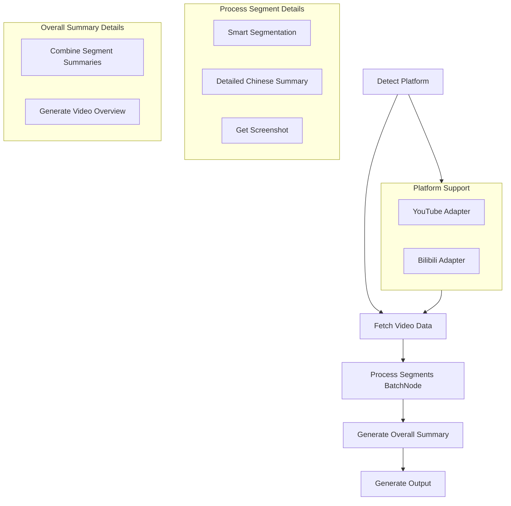

# Design Doc: YouTube Summarizer

> Please DON'T remove notes for AI

## Requirements

> Notes for AI: Keep it simple and clear.
> If the requirements are abstract, write concrete user stories

**用户故事：**
- 作为一个用户，我想要输入一个YouTube或B站视频链接，获得结构化的中文总结
- 作为一个用户，我想要看到每个总结段落对应的时间戳，以便快速跳转到原视频
- 作为一个用户，我想要获得关键时刻的截图，帮助我快速理解视频内容
- 作为一个用户，我想要所有内容（总结、截图）保存在一个文件夹中，便于管理和分享
- 作为一个用户，我想要先看到详细的分段总结，再看到整体的视频总结
- 作为一个用户，我想要系统自动识别视频平台，无需手动选择

**具体需求：**
1. 输入：YouTube视频URL 或 B站视频URL（支持BV号、AV号等格式）
2. 平台支持：
   - YouTube: 标准YouTube链接
   - B站: www.bilibili.com, b23.tv短链接, BV号, AV号
   - 自动平台检测和适配
3. 输出：包含以下内容的文件夹
   - 中文总结的markdown文件（包含时间戳链接）
   - 关键时刻的截图文件
   - 结构化的文件组织
   - 分段详细总结 + 整体视频总结

## Flow Design

> Notes for AI:
>
> 1. Consider the design patterns of agent, map-reduce, rag, and workflow. Apply them if they fit.
> 2. Present a concise, high-level description of the workflow.

### Applicable Design Pattern:

1. **Map-Reduce**: 将字幕分段处理，每段独立进行中文总结和截图获取，最后合并并生成整体总结
2. **Workflow**: 处理步骤：获取字幕 → 分段总结 → 整体总结 → 生成输出

### Flow high-level Design:

1. **Detect Platform Node**: 自动检测输入URL的视频平台（YouTube/B站）
2. **Fetch Video Data Node**: 根据平台获取视频字幕和基本信息（标题、时长等）
3. **Process Segments Batch Node**: 根据字幕内容智能分段，对每段进行详细中文总结并获取截图
4. **Generate Overall Summary Node**: 基于所有分段总结，生成整体的视频总结
5. **Generate Output Node**: 生成结构化的markdown文件和组织文件夹



## Utility Functions

> Notes for AI:
>
> 1. Understand the utility function definition thoroughly by reviewing the doc.
> 2. Include only the necessary utility functions, based on nodes in the flow.

1. **Call LLM** (`src/utils/callLlm.ts`)
   - _Input_: prompt (str)
   - _Output_: response (str)
   - 用于中文总结和整体总结任务

2. **Platform Detection** (`src/utils/platformDetector.ts`)
   - _Input_: video URL (str)
   - _Output_: { platform: 'youtube' | 'bilibili', videoId: str, originalUrl: str }
   - 自动检测视频平台并提取视频ID

3. **Multi-Platform Video Data** (`src/utils/getVideoData.ts`)
   - _Input_: { platform: str, videoId: str, originalUrl: str }
   - _Output_: { title: str, subtitles: Array<{start: number, end: number, text: str}>, duration: number, platform: str }
   - 统一接口获取不同平台的视频数据
   - YouTube: 使用yt-dlp或youtube-transcript-api
   - B站: 使用bilibili-api或you-get

4. **Multi-Platform Screenshot** (`src/utils/getScreenshot.ts`)
   - _Input_: { platform: str, videoId: str, timestamp: number }
   - _Output_: imageUrl (str)
   - 支持不同平台的视频截图获取
   - YouTube: 使用标准缩略图API
   - B站: 使用B站视频封面API或第三方截图服务

5. **File System Operations** (`src/utils/fileSystem.ts`)
   - _Input_: various file operations
   - _Output_: success/error status
   - 创建文件夹、下载图片、生成markdown等

6. **Smart Segmentation** (`src/utils/segmentation.ts`)
   - _Input_: subtitles array
   - _Output_: segmented groups based on content
   - 基于内容相关性进行智能分段，而非简单的时间分段

7. **Video Platform Adapters** (`src/utils/adapters/`)
   - YouTube Adapter (`youtubeAdapter.ts`)
   - Bilibili Adapter (`bilibiliAdapter.ts`)
   - 实现统一的VideoSupport接口

## Node Design

### Shared Memory

> Notes for AI: Try to minimize data redundancy

The shared memory structure is organized as follows:

```typescript
interface SharedMemory {
  // 用户输入和平台信息
  inputUrl: string;                    // 原始输入URL
  platform?: 'youtube' | 'bilibili';  // 检测到的平台
  videoId?: string;                    // 平台特定的视频ID
  videoTitle?: string;
  totalDuration?: number;
  
  // 平台特定元数据
  platformMetadata?: {
    // YouTube特有字段
    channelName?: string;
    // B站特有字段
    bvid?: string;
    aid?: string;
    cid?: string;
    uploader?: string;
    tags?: string[];
  };
  
  // 字幕数据（标准化格式）
  subtitles?: Array<{
    start: number;
    end: number;
    text: string;
  }>;
  
  // 处理后的分段数据
  segments?: Array<{
    startTime: number;
    endTime: number;
    originalText: string;
    detailedSummary: string;  // 详细分段总结
    screenshotUrl?: string;
    screenshotPath?: string;
  }>;
  
  // 整体总结
  overallSummary?: {
    keyPoints: string[];      // 主要观点
    mainTheme: string;        // 主题
    conclusion: string;       // 结论
    fullSummary: string;      // 完整总结
  };
  
  // 输出配置
  outputDir?: string;
  screenshotsDir?: string;
  markdownPath?: string;
  segmentMinutesMin: number; // 最小分段时长（分钟）
  segmentMinutesMax: number; // 最大分段时长（分钟）
  
  // 最终结果
  markdownContent?: string;
}
```

### Node Steps

> Notes for AI: Carefully decide whether to use Batch/Node/Flow.

1. **Detect Platform Node**
   - _Purpose_: 自动检测输入URL的视频平台并提取视频ID
   - _Type_: Regular Node
   - _Steps_:
     - _prep_: 读取inputUrl from shared store
     - _exec_: 调用platformDetector工具函数，解析URL并识别平台
     - _post_: 写入platform, videoId到shared store

2. **Fetch Video Data Node**
   - _Purpose_: 根据平台获取视频字幕和基本信息
   - _Type_: Regular Node
   - _Steps_:
     - _prep_: 读取platform, videoId, inputUrl from shared store
     - _exec_: 调用getVideoData工具函数，根据平台获取视频数据
     - _post_: 写入videoTitle, subtitles, totalDuration, platformMetadata到shared store，创建输出文件夹

3. **Process Segments Controlled Parallel Node**
   - _Purpose_: 智能分段字幕，进行详细中文总结并获取截图（并行处理但控制速率）
   - _Type_: Custom Node with Rate-Limited Parallel Processing
   - _Rate Limit Strategy_: 
     - 最大并发数：3个请求
     - 批次间延迟：2秒
     - 请求重试：指数退避策略
   - _Steps_:
     - _prep_: 使用智能分段算法，基于内容相关性和时间长度分组字幕文本
     - _exec_: 分批并行处理段落，每批最多3个，对每段字幕调用callLlm进行详细中文总结（200-400字），并根据platform调用对应的截图获取函数
     - _post_: 将处理后的segments数组写入shared store

4. **Generate Overall Summary Node**
   - _Purpose_: 基于所有分段总结，生成整体的视频总结
   - _Type_: Regular Node
   - _Steps_:
     - _prep_: 读取所有segments的detailedSummary和videoTitle
     - _exec_: 调用callLlm生成整体总结，包括主要观点、主题、结论等
     - _post_: 将overallSummary写入shared store

5. **Generate Output Node**
   - _Purpose_: 生成最终的markdown文件和组织文件结构
   - _Type_: Regular Node
   - _Steps_:
     - _prep_: 读取完整的segments数组、overallSummary和videoTitle
     - _exec_: 生成结构化的markdown内容，下载截图
     - _post_: 写入markdown文件，组织截图文件夹结构

## Platform Adapter Design

为了支持多平台，我们使用适配器模式来抽象不同平台的差异：

### VideoSupport Interface

```typescript
interface VideoSupport {
  // 平台标识
  platform: 'youtube' | 'bilibili';
  
  // 检测是否支持该URL
  canHandle(url: string): boolean;
  
  // 提取视频ID
  extractVideoId(url: string): string;
  
  // 获取视频基本信息和字幕
  getVideoData(videoId: string): Promise<{
    title: string;
    duration: number;
    subtitles: Array<{start: number; end: number; text: string}>;
    metadata: Record<string, any>;
  }>;
  
  // 获取截图URL
  getScreenshotUrl(videoId: string, timestamp: number): string;
  
  // 生成视频跳转链接
  generateTimestampUrl(videoId: string, timestamp: number): string;
}
```

### Platform-Specific Implementations

#### YouTube Adapter

```typescript
class YouTubeAdapter implements VideoSupport {
  platform = 'youtube' as const;
  
  canHandle(url: string): boolean {
    return /(?:youtube\.com|youtu\.be)/.test(url);
  }
  
  extractVideoId(url: string): string {
    // 支持多种YouTube URL格式
    const patterns = [
      /(?:youtube\.com\/watch\?v=|youtu\.be\/)([^&\n?#]+)/,
      /youtube\.com\/embed\/([^&\n?#]+)/,
    ];
    for (const pattern of patterns) {
      const match = url.match(pattern);
      if (match) return match[1];
    }
    throw new Error('Invalid YouTube URL');
  }
  
  async getVideoData(videoId: string) {
    // 使用yt-dlp或youtube-transcript-api
    // 实现字幕获取逻辑
  }
  
  getScreenshotUrl(videoId: string, timestamp: number): string {
    return `https://img.youtube.com/vi/${videoId}/maxresdefault.jpg`;
  }
  
  generateTimestampUrl(videoId: string, timestamp: number): string {
    return `https://www.youtube.com/watch?v=${videoId}&t=${Math.floor(timestamp)}s`;
  }
}
```

#### Bilibili Adapter

```typescript
class BilibiliAdapter implements VideoSupport {
  platform = 'bilibili' as const;
  
  canHandle(url: string): boolean {
    return /(?:bilibili\.com|b23\.tv)/.test(url) || /^(BV|AV)/i.test(url);
  }
  
  extractVideoId(url: string): string {
    // 支持多种B站URL格式
    if (/^BV[0-9A-Za-z]+$/.test(url)) return url; // 直接是BV号
    if (/^AV\d+$/i.test(url)) return url; // 直接是AV号
    if (/b23\.tv/.test(url)) {
      // 处理短链接，需要解析重定向
    }
    const bvMatch = url.match(/\/video\/(BV[0-9A-Za-z]+)/);
    if (bvMatch) return bvMatch[1];
    const avMatch = url.match(/\/video\/(av\d+)/i);
    if (avMatch) return avMatch[1];
    throw new Error('Invalid Bilibili URL');
  }
  
  async getVideoData(videoId: string) {
    // 使用bilibili-api或you-get
    // 实现B站字幕获取逻辑
    // 注意：B站字幕可能需要特殊处理
  }
  
  getScreenshotUrl(videoId: string, timestamp: number): string {
    // B站截图需要通过API获取或使用封面图
    return `https://api.bilibili.com/x/player/videoshot?bvid=${videoId}&index=1`;
  }
  
  generateTimestampUrl(videoId: string, timestamp: number): string {
    return `https://www.bilibili.com/video/${videoId}?t=${Math.floor(timestamp)}`;
  }
}
```

### Platform Registry

```typescript
class PlatformRegistry {
  private adapters: VideoSupport[] = [
    new YouTubeAdapter(),
    new BilibiliAdapter(),
  ];
  
  detectPlatform(url: string): VideoSupport {
    for (const adapter of this.adapters) {
      if (adapter.canHandle(url)) {
        return adapter;
      }
    }
    throw new Error(`Unsupported platform for URL: ${url}`);
  }
}
```

### Error Handling & Fallbacks

1. **平台检测失败**: 提供明确的错误信息，建议支持的URL格式
2. **字幕获取失败**: 
   - YouTube: 尝试自动生成字幕
   - B站: 提示用户该视频可能没有字幕
3. **截图获取失败**: 使用视频封面作为fallback
4. **网络错误**: 实现重试机制和超时处理

## Implementation Priority

### Phase 1: Core Multi-Platform Support
1. 实现PlatformRegistry和基础适配器接口
2. YouTube Adapter (重构现有代码)
3. Bilibili Adapter (基础BV号支持)
4. 更新Detect Platform Node和Fetch Video Data Node

### Phase 2: Enhanced Platform Features  
1. 完善B站URL格式支持（AV号、短链接）
2. 优化截图获取功能
3. 添加平台特定的元数据处理
4. 错误处理和重试机制

### Phase 3: Advanced Features
1. B站分P视频支持
2. 字幕质量检测和fallback
3. 性能优化和缓存
4. 用户体验改进（进度显示、更好的错误提示）

### Testing Strategy
- 单元测试：每个适配器的核心功能
- 集成测试：完整的视频处理流程
- 边界测试：各种URL格式、错误情况
- 平台测试：确保两个平台的功能一致性
